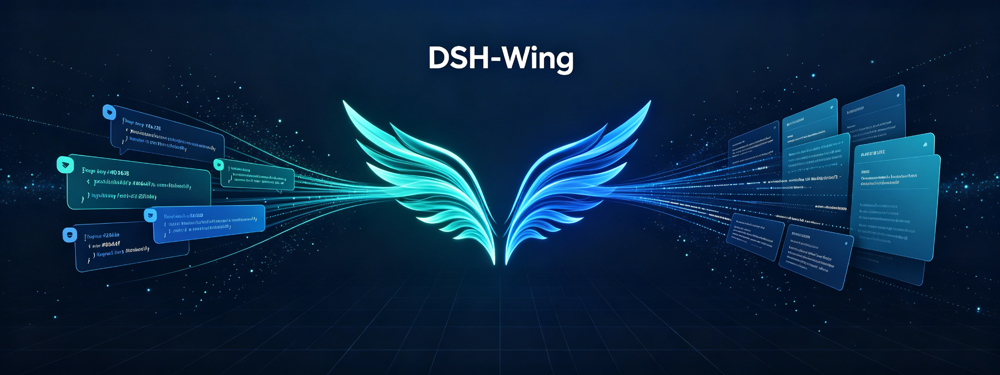
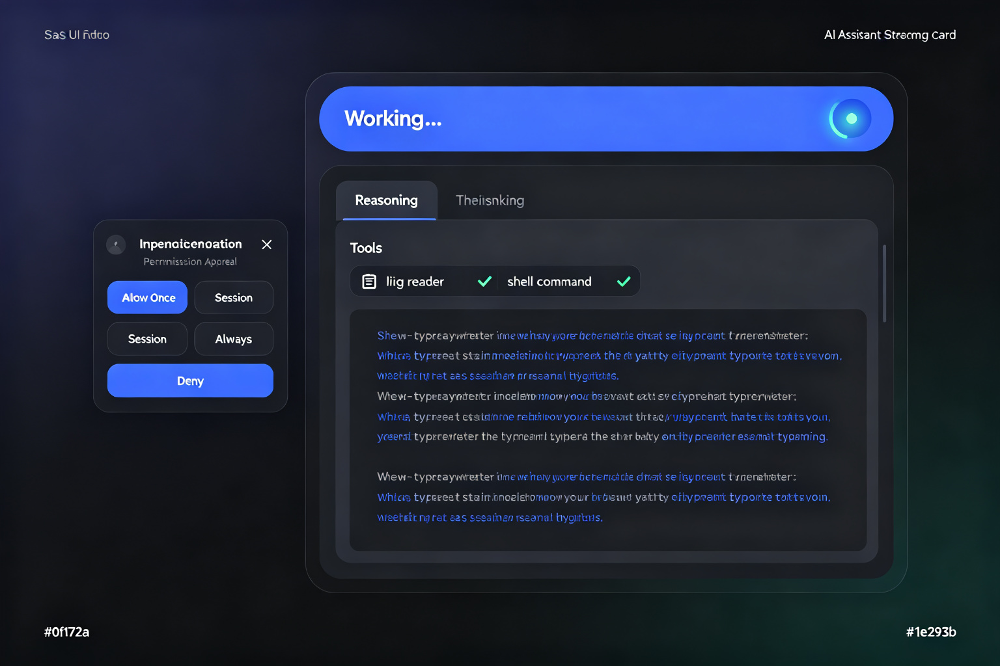

<div align="center">



# 🪽 DSH-Wing

### **DeepSeek Harness 飞书原生插件 — 过程透明 · 插话不打断 · 完整桥能力**

*A native Feishu (Lark) plugin for DeepSeek Harness: transparent streaming, non-interruptive follow-ups, and full bridge capabilities.*

[](https://opensource.org/licenses/MIT)
[](https://nodejs.org/)
[](https://www.typescriptlang.org/)
[](https://github.com/wanwang416/DSH-Wing/actions)
[](https://github.com/deepseek-ai/deepseek-harness)

</div>

---

## ✨ 核心特性 / Core Features

<div align="center">

</div>

### 🎯 过程透明 / Transparent Streaming
思考过程流式呈现，单卡打字机效果，告别黑盒。**CardKit 流式引擎**支持三级降级：CardKit 打字机 → 全量卡片更新 → 普通文本消息，确保任何环境下都能稳定输出。

### 💬 插话不打断 / Non-Interruptive Follow-ups
任务进行中可随时插话，主任务不丢上下文。**四类中断分类器**智能识别：
- **COMMAND**（停止/改道）→ 立即中断
- **QUESTION / CONFIRM**（疑问/确认）→ 排队注入，不打断主任务
- **ORDINARY**（推进词/纯确认）→ 推进词注入，纯确认仅回执
- 可通过 `DSH_WING_INTERRUPT_CLASSIFIER=0` 回退经典模式

### 🎛️ 交互卡片 / Interactive Cards
- **单选卡**：`/preset` `/model` `/mode` `/permission` 一键切换
- **审批卡**：危险操作四按钮（Allow Once / Session / Always / Deny），支持老板 `open_id` 限定，防止群聊他人越权批准

### 🔒 权限控制 / Permission System
三档权限粒度，默认保守：
| 模式 | 说明 |
|------|------|
| `read-only` | 只读，禁止任何写操作 |
| `workspace-write` | **默认**，仅允许工作区内写入 |
| `danger-full-access` | 完全访问，危险操作弹审批卡 |

### 🧭 意图路由 / Intent Routing
群聊命令 / 提问 / 闲聊智能分流，纯寒暄不误触发 agent。支持 `open` / `mention` / `keywords` / `reply` 四种群聊触发策略。

### 🛡️ 可靠性 / Reliability
- **断线补偿**：WS 断连期间消息不丢，重连后自动补偿
- **撤回即停**：用户撤回消息 → 立即取消对应 agent 任务
- **WAL 留痕**：入站消息预写日志，崩溃可恢复
- **连接自愈**：WS 假死检测（60s ping timeout）+ 自动重连
- **Outbox 重试**：出站消息失败自动重试，指数退避

---

## 🏗️ 架构设计 / Architecture

<div align="center">

</div>

### 三层架构 / Three-Layer Architecture

```
┌─────────────────────────────────────────────────────────┐
│  平台接入层 / Platform Adapter Layer                      │
│  ┌──────────┐  ┌──────────┐  ┌──────────────────────┐  │
│  │ Feishu   │  │ WebSocket│  │ Event Dispatcher     │  │
│  │ SDK      │  │ Client   │  │                      │  │
│  └──────────┘  └──────────┘  └──────────────────────┘  │
├─────────────────────────────────────────────────────────┤
│  核心层 / Core Engine Layer (平台无关)                    │
│  ┌──────────┐ ┌──────────┐ ┌──────────┐ ┌───────────┐ │
│  │ Inbound  │ │ Session  │ │ Experience│ │ Outbound  │ │
│  │ Pipeline │ │ Manager  │ │ Layer     │ │ Outbox    │ │
│  │ (解析/去重│ │ (映射/持久│ │ (流式/插话│ │ (重试/降级│ │
│  │  /批处理) │ │  化/序列化)│ │ /工具可见)│ │  /分片)   │ │
│  └──────────┘ └──────────┘ └──────────┘ └───────────┘ │
├─────────────────────────────────────────────────────────┤
│  Agent 驱动层 / Agent Driver Layer (DSH 原生)            │
│  ┌──────────┐  ┌──────────┐  ┌──────────────────────┐  │
│  │ DSH Agent│  │ Tool Call│  │ LLM / Reasoning      │  │
│  │ Driver   │  │ Stream   │  │                      │  │
│  └──────────┘  └──────────┘  └──────────────────────┘  │
└─────────────────────────────────────────────────────────┘
```

### 消息链路 / Message Flow

```
飞书消息 → WS → Dispatcher → Session Mapper → DSH Agent
    → Session Events (6种) → Forwarder → Experience
    → Sender / Outbox → 飞书回复
```

---

## 🚀 快速开始 / Quick Start

### 前置要求 / Prerequisites

- **Node.js >= 24.0.0**
- DeepSeek Harness (DSH) 运行环境
- 飞书自建应用（App ID + App Secret）

### 安装 / Installation

```bash
# 克隆仓库
git clone https://github.com/wanwang416/DSH-Wing.git
cd DSH-Wing

# 安装依赖
npm install

# 构建（host tsc + client tsdown）
npm run build
```

### 配置 / Configuration

```bash
# 1. 复制配置模板
cp cordis.patch.example.yml cordis.patch.yml

# 2. 编辑配置
#    - workspaceRoot: 你的工作区路径
#    - groupPolicy: 群聊触发策略 (open/mention/keywords/reply)
#    - permissionMode: 权限模式 (read-only/workspace-write/danger-full-access)
```

**凭据配置**（二选一）：

**方式 A — DSH 凭据系统（推荐）：**
```bash
# 在 DSH 凭据系统中注册
# credentialRef: WING_LARK_APP
# 值: {"appId":"cli_xxx","appSecret":"xxx","domain":"feishu"}
```

**方式 B — 环境变量：**
```bash
export DSH_WING_APP_ID=cli_xxxxxxxxxxxx
export DSH_WING_APP_SECRET=xxxxxxxxxxxxxxxxxxxxxxxxxxxxxxxx
```

### 初始化飞书应用 / Setup

```bash
# 运行交互式 setup（生成 QR 码，扫码注册飞书应用）
npx dsh-wing setup

# 或使用 /setup 命令在飞书聊天中触发
```

### 诊断 / Diagnostics

```bash
# 环境检查
npx dsh-wing doctor

# WebSocket 连接测试
node scripts/diag-ws.mjs

# 消息监听测试
node scripts/diag-listen.mjs
```

---

## 📋 命令参考 / Command Reference

| 命令 | 说明 |
|------|------|
| `/preset` | 切换 Agent Preset（code / general / ...） |
| `/model` | 切换 LLM 模型 |
| `/mode` | 切换运行模式 |
| `/permission` | 切换权限模式 |
| `/resume` | 恢复历史会话 |
| `/workspace` | 查看/切换工作区 |
| `/steer` | 温和打断当前任务 |
| `/stop` | 立即停止当前任务 |
| `/setup` | 初始化飞书应用配置 |
| `/status` | 查看当前状态 |
| `/doctor` | 环境诊断检查 |
| `/new` | 开启新会话 |
| `/help` | 显示帮助 |

---

## ⚙️ 配置详解 / Configuration

### cordis.patch.yml

```yaml
- insert:
    - id: wing
      name: 'dsh-wing'
      config:
        enabled: true
        credentialRef: WING_LARK_APP     # DSH 凭据引用名
        appId: ''                          # 或环境变量 DSH_WING_APP_ID
        appSecret: ''                      # 或环境变量 DSH_WING_APP_SECRET
        groupPolicy: mention               # open/mention/keywords/reply
        workspaceRoot: /path/to/workspace  # 工作区根目录
        streaming:
          enabled: true                     # 默认开启流式
          flushMs: 500                      # 流式刷新间隔
        permissionMode: workspace-write     # 默认保守权限
        turnTimeoutMs: 600000              # 轮次超时（10分钟）
        agentPreset: code                   # 默认 Agent Preset
        bossOpenId: ''                      # 老板 open_id（审批卡限定）
        steerDiagLogPath: ''                # steer 诊断日志路径（默认关闭）
```

### 环境变量 / Environment Variables

| 变量 | 说明 | 默认 |
|------|------|------|
| `DSH_WING_APP_ID` | 飞书 App ID 覆盖 | — |
| `DSH_WING_APP_SECRET` | 飞书 App Secret 覆盖 | — |
| `DSH_WING_INTERRUPT_CLASSIFIER` | 中断分类器开关（`0`=关闭） | `1` |
| `DSH_WING_SDK_LOG` | 飞书 SDK 日志文件路径 | — |
| `DSH_HOME` | DSH 主目录（诊断脚本用） | — |

---

## 🛠️ 开发 / Development

```bash
# 类型检查
npm run typecheck

# 仅构建 host（tsc）
npm run build:host

# 仅构建 client（tsdown / rolldown）
npm run build:client

# 完整构建（host + client）
npm run build

# 运行测试
npm test

# 监听模式测试
npm run test:watch

# 覆盖率报告
npm run coverage
```

### 项目结构 / Project Structure

```
DSH-Wing/
├── src/
│   ├── index.ts              # 插件入口，组装所有模块
│   ├── agent/                # Agent 驱动层
│   │   ├── caller.ts         # Agent 调用封装
│   │   ├── experience.ts     # 体验契约（流式/插话/工具可见）
│   │   ├── forwarder.ts      # 事件转发器
│   │   ├── intent.ts         # 意图识别
│   │   ├── model.ts          # 模型管理
│   │   ├── permission.ts     # 权限判断
│   │   ├── preset.ts         # Preset 管理
│   │   ├── turn-supervisor.ts # 轮次监督器
│   │   └── user-questions.ts # 用户问题处理
│   ├── client/               # 前端客户端（DSH ModuleLoader）
│   │   ├── index.ts
│   │   └── icons.ts
│   ├── commands/             # 斜杠命令
│   ├── config/               # 配置默认值
│   ├── doctor/               # 环境诊断
│   ├── host/                 # 平台接入层
│   │   ├── client.ts         # 飞书 SDK 客户端
│   │   ├── credentials.ts    # 凭据管理
│   │   ├── quota.ts          # 配额治理
│   │   ├── status.ts         # 状态存储
│   │   ├── supervisor.ts     # 连接监督器
│   │   └── websocket.ts      # WebSocket 传输
│   ├── inbound/              # 入站管道
│   │   ├── batching.ts       # 消息批处理
│   │   ├── chat-type.ts      # 聊天类型判断
│   │   ├── compensation.ts   # 断线补偿
│   │   ├── dedup.ts          # 消息去重
│   │   ├── dispatcher.ts     # 事件分发
│   │   ├── event-handler.ts  # 事件处理器
│   │   ├── group-policy.ts   # 群聊策略
│   │   ├── interrupt-classify.ts # 中断分类器
│   │   ├── parser.ts         # 消息解析
│   │   └── wal.ts            # 预写日志
│   ├── interactive/          # 交互卡片
│   │   ├── approval.ts       # 审批卡
│   │   ├── reaction.ts       # 表情回应
│   │   ├── router.ts         # 交互路由
│   │   └── selector.ts       # 单选卡
│   ├── outbound/             # 出站管道
│   │   ├── cardkit.ts        # CardKit 封装
│   │   ├── chunker.ts        # 消息分片
│   │   ├── fallback.ts       # 降级策略
│   │   ├── outbox.ts         # 出站队列
│   │   ├── sender.ts         # 消息发送
│   │   ├── streaming-card.ts # 流式卡片引擎
│   │   └── tool-step.ts      # 工具步骤渲染
│   ├── session/              # 会话管理
│   ├── setup/                # 初始化流程
│   └── web/                  # Web 面板
├── tests/                    # 562 个单元测试
├── scripts/                  # 诊断脚本
├── docs/assets/              # 文档素材
├── .github/workflows/ci.yml  # CI 配置
├── package.json
├── tsconfig.json
├── tsdown.config.ts
└── cordis.patch.example.yml
```

---

## 🗺️ 路线图 / Roadmap

| 里程碑 | 内容 | 状态 |
|--------|------|------|
| **M0** | 骨架 + API 签名 + 插话验证 | ✅ 完成 |
| **M1** | 最小可用 + 体验先行（流式 / 插话 / 权限保守 / Outbox） | ✅ 完成 |
| **M2** | 可靠性 + 富文本 + 全事件 | ✅ 完成 |
| **M3** | 交互 + 权限 + 插话增强（CardKit 流式 / ToolStep 富卡片） | ✅ 完成 |
| **M4** | 易用性 + 诊断 + 完整度补齐 | ✅ 完成 |
| **M4.1** | 单选卡 + 审批卡 + 意图桥 + 第二批命令 | ✅ 完成 · 562 tests |
| **M5** | 多平台扩展（Discord / Telegram / Slack） | 📋 规划中 |
| **M6** | 插件市场 + 可视化配置面板 | 📋 规划中 |

---

## 🤝 贡献 / Contributing

欢迎提交 Issue 和 Pull Request！

1. Fork 本仓库
2. 创建特性分支 (`git checkout -b feature/AmazingFeature`)
3. 提交更改 (`git commit -m 'Add some AmazingFeature'`)
4. 推送到分支 (`git push origin feature/AmazingFeature`)
5. 开启 Pull Request

---

## 📄 许可证 / License

本项目采用 [MIT License](LICENSE) 开源协议。

---

<div align="center">

**用 ❤️ 和 TypeScript 构建**

*Powered by DeepSeek Harness · Feishu Open Platform*

</div>
