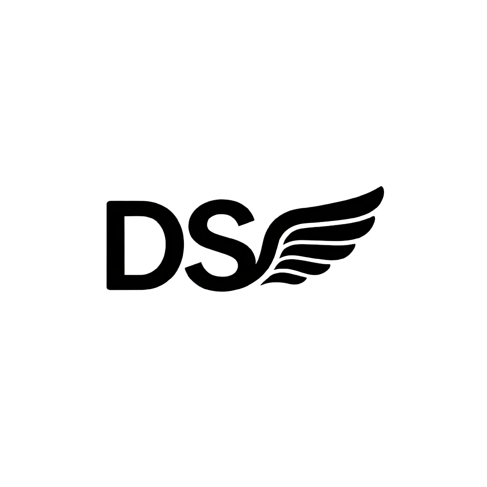

<div align="center">



# DSH-Wing

### **A native Feishu (Lark) plugin for DeepSeek Harness — transparent streaming · non-interruptive follow-ups · full bridge capabilities**

*DeepSeek Harness 飞书原生插件 — 过程透明 · 插话不打断 · 完整桥能力*

[](https://opensource.org/licenses/MIT)
[](https://nodejs.org/)
[](https://www.typescriptlang.org/)
[](https://github.com/wanwang416/DSH-Wing/actions)
[](https://github.com/deepseek-ai/deepseek-harness)

<br/>


</div>

---

## ✨ Core Features / 核心特性

<div align="center">

</div>

### 🎯 Transparent Streaming / 过程透明

The agent's thinking is rendered as a single typewriter card — never a black box. The **CardKit streaming engine** supports three-level degradation: CardKit typewriter → full card update → plain text message, ensuring stable output in any environment.
思考过程流式呈现，单卡打字机效果，告别黑盒。CardKit 流式引擎支持三级降级。

### 💬 Non-Interruptive Follow-ups / 插话不打断

Interject anytime during a running task; the main task keeps its context. The **four-class interrupt classifier** intelligently identifies:
任务进行中可随时插话，主任务不丢上下文。四类中断分类器智能识别：
- **COMMAND** (stop / redirect) → immediate interruption / 立即中断
- **QUESTION / CONFIRM** (doubt / confirmation) → queued injection, does not interrupt the main task / 排队注入，不打断主任务
- **ORDINARY** (progress word / pure confirmation) → progress-word injection, pure confirmation only acknowledges / 推进词注入，纯确认仅回执
- Fallback to classic mode via `DSH_WING_INTERRUPT_CLASSIFIER=0` / 可通过环境变量回退经典模式

### 🎛️ Interactive Cards / 交互卡片

- **Single-select cards** — `/preset` `/model` `/mode` `/permission` one-tap switching / 单选卡一键切换
- **Approval cards** — four buttons for dangerous operations (Allow Once / Session / Always / Deny), with boss `open_id` restriction to prevent unauthorized approval in group chats / 审批卡四按钮，支持老板 open_id 限定，防止群聊他人越权批准

### 🔒 Permission System / 权限控制

Three permission tiers, conservative by default / 三档权限粒度，默认保守：

| Mode / 模式 | Description / 说明 |
|------|------|
| `read-only` | Read-only, no write operations allowed / 只读，禁止任何写操作 |
| `workspace-write` | **Default**, writes allowed only within the workspace / **默认**，仅允许工作区内写入 |
| `danger-full-access` | Full access, dangerous operations trigger approval card / 完全访问，危险操作弹审批卡 |

### 🧭 Intent Routing / 意图路由

Group-chat commands, questions, and small talk are routed intelligently; pure greetings never trigger the agent. Supports four group-chat trigger strategies: `open` / `mention` / `keywords` / `reply`.
群聊命令 / 提问 / 闲聊智能分流，纯寒暄不误触发 agent。支持四种群聊触发策略。

### 🛡️ Reliability / 可靠性

- **Disconnect compensation** — messages are not lost during WS disconnection, automatically compensated after reconnect / 断线补偿，WS 断连期间消息不丢，重连后自动补偿
- **Stop on recall** — recalling a message immediately cancels the corresponding agent task / 撤回即停，用户撤回消息 → 立即取消对应 agent 任务
- **WAL persistence** — inbound messages are pre-written to a log, recoverable after crash / WAL 留痕，入站消息预写日志，崩溃可恢复
- **Self-healing reconnect** — WS hang detection (60s ping timeout) + automatic reconnect / 连接自愈，WS 假死检测 + 自动重连
- **Outbox retry** — failed outbound messages are retried automatically with exponential backoff / Outbox 重试，出站消息失败自动重试，指数退避

---

## 🏗️ Architecture / 架构设计

<div align="center">

</div>

### Three-Layer Architecture / 三层架构

```
┌─────────────────────────────────────────────────────────┐
│  Platform Adapter Layer / 平台接入层                      │
│  ┌──────────┐  ┌──────────┐  ┌──────────────────────┐  │
│  │ Feishu   │  │ WebSocket│  │ Event Dispatcher     │  │
│  │ SDK      │  │ Client   │  │                      │  │
│  └──────────┘  └──────────┘  └──────────────────────┘  │
├─────────────────────────────────────────────────────────┤
│  Core Engine Layer / 核心层 (platform-agnostic / 平台无关)│
│  ┌──────────┐ ┌──────────┐ ┌──────────┐ ┌───────────┐ │
│  │ Inbound  │ │ Session  │ │ Experience│ │ Outbound  │ │
│  │ Pipeline │ │ Manager  │ │ Layer     │ │ Outbox    │ │
│  │(parse/   │ │(map/     │ │(stream/  │ │(retry/    │ │
│  │ dedup/   │ │ persist/ │ │ interject│ │ degrade/  │ │
│  │ batch)   │ │ serialize)│ │ /tools)  │ │ shard)    │ │
│  └──────────┘ └──────────┘ └──────────┘ └───────────┘ │
├─────────────────────────────────────────────────────────┤
│  Agent Driver Layer / Agent 驱动层 (DSH-native / DSH 原生)│
│  ┌──────────┐  ┌──────────┐  ┌──────────────────────┐  │
│  │ DSH Agent│  │ Tool Call│  │ LLM / Reasoning      │  │
│  │ Driver   │  │ Stream   │  │                      │  │
│  └──────────┘  └──────────┘  └──────────────────────┘  │
└─────────────────────────────────────────────────────────┘
```

### Message Flow / 消息链路

```
Feishu message → WS → Dispatcher → Session Mapper → DSH Agent
    → Session Events (6 types) → Forwarder → Experience
    → Sender / Outbox → Feishu reply
```

---

## 🚀 Quick Start / 快速开始

### Prerequisites / 前置要求

- **Node.js >= 24.0.0**
- DeepSeek Harness (DSH) runtime / DSH 运行环境
- Feishu self-built application (App ID + App Secret) / 飞书自建应用

### Installation / 安装

```bash
# Clone the repository / 克隆仓库
git clone https://github.com/wanwang416/DSH-Wing.git
cd DSH-Wing

# Install dependencies / 安装依赖
npm install

# Build (host tsc + client tsdown) / 构建
npm run build
```

### Configuration / 配置

```bash
# 1. Copy the config template / 复制配置模板
cp cordis.patch.example.yml cordis.patch.yml

# 2. Edit the config / 编辑配置
#    - workspaceRoot: your workspace path / 你的工作区路径
#    - groupPolicy: group-chat trigger strategy (open/mention/keywords/reply) / 群聊触发策略
#    - permissionMode: permission mode (read-only/workspace-write/danger-full-access) / 权限模式
```

**Credential configuration** (choose one) / **凭据配置**（二选一）：

**Option A — DSH credential system (recommended) / 方式 A — DSH 凭据系统（推荐）：**
```bash
# Register in the DSH credential system / 在 DSH 凭据系统中注册
# credentialRef: WING_LARK_APP
# value: {"appId":"cli_xxx","appSecret":"xxx","domain":"feishu"}
```

**Option B — Environment variables / 方式 B — 环境变量：**
```bash
export DSH_WING_APP_ID=cli_xxxxxxxxxxxx
export DSH_WING_APP_SECRET=xxxxxxxxxxxxxxxxxxxxxxxxxxxxxxxx
```

### Setup Feishu Application / 初始化飞书应用

```bash
# Run interactive setup (generates a QR code, scan to register the Feishu app)
# 运行交互式 setup（生成 QR 码，扫码注册飞书应用）
npx dsh-wing setup

# Or trigger via the /setup command in a Feishu chat
# 或使用 /setup 命令在飞书聊天中触发
```

### Diagnostics / 诊断

```bash
# Environment check / 环境检查
npx dsh-wing doctor

# WebSocket connection test / WebSocket 连接测试
node scripts/diag-ws.mjs

# Message listener test / 消息监听测试
node scripts/diag-listen.mjs
```

---

## 📋 Command Reference / 命令参考

| Command / 命令 | Description / 说明 |
|------|------|
| `/preset` | Switch Agent Preset (code / general / ...) / 切换 Agent Preset |
| `/model` | Switch LLM model / 切换 LLM 模型 |
| `/mode` | Switch runtime mode / 切换运行模式 |
| `/permission` | Switch permission mode / 切换权限模式 |
| `/resume` | Resume a historical session / 恢复历史会话 |
| `/workspace` | View / switch workspace / 查看/切换工作区 |
| `/steer` | Gently interrupt the current task / 温和打断当前任务 |
| `/stop` | Immediately stop the current task / 立即停止当前任务 |
| `/setup` | Initialize Feishu application config / 初始化飞书应用配置 |
| `/status` | View current status / 查看当前状态 |
| `/doctor` | Environment diagnostic check / 环境诊断检查 |
| `/new` | Start a new session / 开启新会话 |
| `/help` | Show help / 显示帮助 |

---

## ⚙️ Configuration Details / 配置详解

### cordis.patch.yml

```yaml
- insert:
    - id: wing
      name: 'dsh-wing'
      config:
        enabled: true
        credentialRef: WING_LARK_APP     # DSH credential reference name / DSH 凭据引用名
        appId: ''                          # or env var DSH_WING_APP_ID / 或环境变量
        appSecret: ''                      # or env var DSH_WING_APP_SECRET / 或环境变量
        groupPolicy: mention               # open/mention/keywords/reply
        workspaceRoot: /path/to/workspace  # workspace root / 工作区根目录
        streaming:
          enabled: true                     # streaming enabled by default / 默认开启流式
          flushMs: 500                      # streaming flush interval / 流式刷新间隔
        permissionMode: workspace-write     # conservative by default / 默认保守权限
        turnTimeoutMs: 600000              # turn timeout (10 minutes) / 轮次超时（10分钟）
        agentPreset: code                   # default Agent Preset / 默认 Agent Preset
        bossOpenId: ''                      # boss open_id (approval card restriction) / 老板 open_id
        steerDiagLogPath: ''                # steer diagnostic log path (off by default) / steer 诊断日志路径
```

### Environment Variables / 环境变量

| Variable / 变量 | Description / 说明 | Default |
|------|------|------|
| `DSH_WING_APP_ID` | Feishu App ID override / 飞书 App ID 覆盖 | — |
| `DSH_WING_APP_SECRET` | Feishu App Secret override / 飞书 App Secret 覆盖 | — |
| `DSH_WING_INTERRUPT_CLASSIFIER` | Interrupt classifier switch (`0`=off) / 中断分类器开关 | `1` |
| `DSH_WING_SDK_LOG` | Feishu SDK log file path / 飞书 SDK 日志文件路径 | — |
| `DSH_HOME` | DSH home directory (for diagnostic scripts) / DSH 主目录（诊断脚本用） | — |

---

## 🛠️ Development / 开发

```bash
# Type check / 类型检查
npm run typecheck

# Build host only (tsc) / 仅构建 host
npm run build:host

# Build client only (tsdown / rolldown) / 仅构建 client
npm run build:client

# Full build (host + client) / 完整构建
npm run build

# Run tests / 运行测试
npm test

# Watch mode tests / 监听模式测试
npm run test:watch

# Coverage report / 覆盖率报告
npm run coverage
```

### Project Structure / 项目结构

```
DSH-Wing/
├── src/
│   ├── index.ts              # Plugin entry, assembles all modules / 插件入口
│   ├── agent/                # Agent driver layer / Agent 驱动层
│   │   ├── caller.ts         # Agent call wrapper / Agent 调用封装
│   │   ├── experience.ts     # Experience contract (stream/interject/tool-visible) / 体验契约
│   │   ├── forwarder.ts      # Event forwarder / 事件转发器
│   │   ├── intent.ts         # Intent recognition / 意图识别
│   │   ├── model.ts          # Model management / 模型管理
│   │   ├── permission.ts     # Permission judgment / 权限判断
│   │   ├── preset.ts         # Preset management / Preset 管理
│   │   ├── turn-supervisor.ts # Turn supervisor / 轮次监督器
│   │   └── user-questions.ts # User question handling / 用户问题处理
│   ├── client/               # Frontend client (DSH ModuleLoader) / 前端客户端
│   │   ├── index.ts
│   │   └── icons.ts
│   ├── commands/             # Slash commands / 斜杠命令
│   ├── config/               # Config defaults / 配置默认值
│   ├── doctor/               # Environment diagnostics / 环境诊断
│   ├── host/                 # Platform adapter layer / 平台接入层
│   │   ├── client.ts         # Feishu SDK client / 飞书 SDK 客户端
│   │   ├── credentials.ts    # Credential management / 凭据管理
│   │   ├── quota.ts          # Quota governance / 配额治理
│   │   ├── status.ts         # Status storage / 状态存储
│   │   ├── supervisor.ts     # Connection supervisor / 连接监督器
│   │   └── websocket.ts      # WebSocket transport / WebSocket 传输
│   ├── inbound/              # Inbound pipeline / 入站管道
│   │   ├── batching.ts       # Message batching / 消息批处理
│   │   ├── chat-type.ts      # Chat type judgment / 聊天类型判断
│   │   ├── compensation.ts   # Disconnect compensation / 断线补偿
│   │   ├── dedup.ts          # Message dedup / 消息去重
│   │   ├── dispatcher.ts     # Event dispatcher / 事件分发
│   │   ├── event-handler.ts  # Event handler / 事件处理器
│   │   ├── group-policy.ts   # Group chat policy / 群聊策略
│   │   ├── interrupt-classify.ts # Interrupt classifier / 中断分类器
│   │   ├── parser.ts         # Message parser / 消息解析
│   │   └── wal.ts            # Write-ahead log / 预写日志
│   ├── interactive/          # Interactive cards / 交互卡片
│   │   ├── approval.ts       # Approval card / 审批卡
│   │   ├── reaction.ts       # Reaction response / 表情回应
│   │   ├── router.ts         # Interaction router / 交互路由
│   │   └── selector.ts       # Single-select card / 单选卡
│   ├── outbound/             # Outbound pipeline / 出站管道
│   │   ├── cardkit.ts        # CardKit wrapper / CardKit 封装
│   │   ├── chunker.ts        # Message chunker / 消息分片
│   │   ├── fallback.ts       # Fallback strategy / 降级策略
│   │   ├── outbox.ts         # Outbound queue / 出站队列
│   │   ├── sender.ts         # Message sender / 消息发送
│   │   ├── streaming-card.ts # Streaming card engine / 流式卡片引擎
│   │   └── tool-step.ts      # Tool step rendering / 工具步骤渲染
│   ├── session/              # Session management / 会话管理
│   ├── setup/                # Setup flow / 初始化流程
│   └── web/                  # Web panel / Web 面板
├── tests/                    # 562 unit tests / 562 个单元测试
├── scripts/                  # Diagnostic scripts / 诊断脚本
├── docs/assets/              # Documentation assets / 文档素材
├── .github/workflows/ci.yml  # CI config / CI 配置
├── package.json
├── tsconfig.json
├── tsdown.config.ts
└── cordis.patch.example.yml
```

---

## 🗺️ Roadmap / 路线图

| Milestone / 里程碑 | Content / 内容 | Status / 状态 |
|--------|------|------|
| **M0** | Skeleton + API signatures + interjection validation / 骨架 + API 签名 + 插话验证 | ✅ Done / 完成 |
| **M1** | MVP + experience-first (streaming / interjection / conservative permissions / Outbox) / 最小可用 + 体验先行 | ✅ Done / 完成 |
| **M2** | Reliability + rich text + full events / 可靠性 + 富文本 + 全事件 | ✅ Done / 完成 |
| **M3** | Interaction + permissions + interjection enhancement (CardKit streaming / ToolStep rich cards) / 交互 + 权限 + 插话增强 | ✅ Done / 完成 |
| **M4** | Usability + diagnostics + completeness / 易用性 + 诊断 + 完整度补齐 | ✅ Done / 完成 |
| **M4.1** | Single-select cards + approval cards + intent bridge + second batch of commands / 单选卡 + 审批卡 + 意图桥 + 第二批命令 | ✅ Done · 562 tests |
| **M4.2** | `/doctor` diagnostic package + Web QR-code setup panel / doctor 诊断包 + Web 扫码面板 | ✅ Done / 完成 |
| **M5** | Multi-platform expansion (Discord / Telegram / Slack) / 多平台扩展 | 📋 Planned / 规划中 |
| **M6** | Plugin marketplace + visual configuration panel / 插件市场 + 可视化配置面板 | 📋 Planned / 规划中 |

---

## 🤝 Contributing / 贡献

Issues and Pull Requests are welcome! / 欢迎提交 Issue 和 Pull Request！

1. Fork the repository / Fork 本仓库
2. Create a feature branch (`git checkout -b feature/AmazingFeature`) / 创建特性分支
3. Commit your changes (`git commit -m 'Add some AmazingFeature'`) / 提交更改
4. Push to the branch (`git push origin feature/AmazingFeature`) / 推送到分支
5. Open a Pull Request / 开启 Pull Request

---

## 📄 License / 许可证

This project is licensed under the [MIT License](LICENSE).
本项目采用 [MIT License](LICENSE) 开源协议。

---

<div align="center">

**Built with ❤️ and TypeScript / 用 ❤️ 和 TypeScript 构建**

*Powered by DeepSeek Harness · Feishu Open Platform*

</div>
